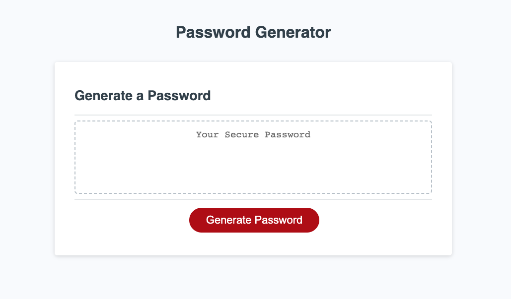

# 03 JavaScript: Password Generator

# <Your-Project-Title>

## Description

This objective of this website is to generate a random password. The user may select the criteria for their password. Criteria includes a character limit of 8-128 characters, lowercase letters, uppercase letters, numbers, or special characters.

## Installation

The HTML, CSS, and JavaScript code can be downloaded via the Homework-03 folder on my Github page. It can also be viewed by visiting the following URL: https://kristinaama.github.io/Homework-03/

## Usage

This random password generator is intended for easy viewing and navigation. Click the "Generate Password" button on the page and follow the prompts that appear on the screen. If a prompt is used incorrectly, the user may be prompted to try again as indicated by the error messages provided.

## Credits

Samantha Rudolph - UC Berkeley Extension Instructor

## License

Please refer to MIT license.
